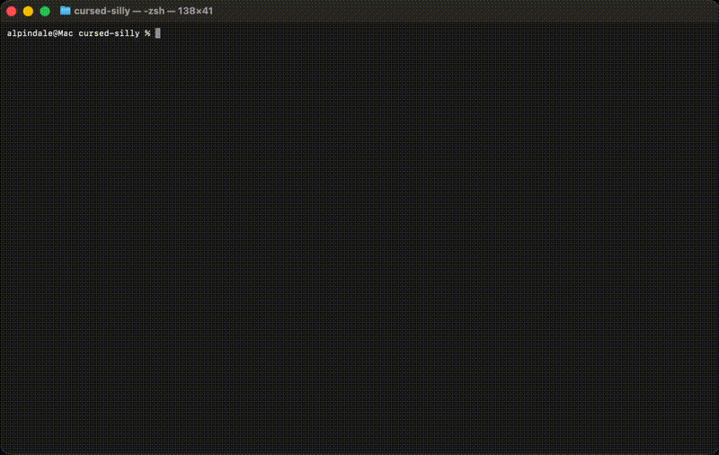

## sillytui

A frontend for chatting/RP with LLMs, designed to be a TUI version of [SillyTavern](https://github.com/SillyTavern/SillyTavern).

Still in development.




### Requirements
- ncurses
- curl
- pthread
- GCC 13+ or Clang 16+ (for C++23 support)

### Installation & Usage

<details>
<summary>Platform-specific installation instructions</summary>

#### macOS
```bash
brew install cmake ncurses curl
git clone https://github.com/AlpinDale/sillytui.git && cd sillytui
make run
```

#### Windows
TODO

#### Ubuntu/Debian (and their variants)
```bash
sudo apt update && sudo apt install -y build-essential cmake libncursesw5-dev libcurl4-openssl-dev
git clone https://github.com/AlpinDale/sillytui.git && cd sillytui
make run
```

If you're using older GCC versions, you will need to do this first (ubuntu):

```bash
sudo add-apt-repository ppa:ubuntu-toolchain-r/test
sudo apt update
sudo apt install gcc-13 g++-13
./tools/setup_gcc13.sh
```

#### Arch Linux
```bash
sudo pacman -S base-devel cmake ncurses curl git
git clone https://github.com/AlpinDale/sillytui.git && cd sillytui
make run
```

#### Fedora
```bash
sudo dnf install cmake ncurses-devel libcurl-devel git
git clone https://github.com/AlpinDale/sillytui.git && cd sillytui
make run
```

#### OpenSUSE
```bash
sudo zypper install cmake ncurses-devel libcurl-devel git
git clone https://github.com/AlpinDale/sillytui.git && cd sillytui
make run
```

#### Gentoo
```bash
sudo emerge -av dev-vcs/git sys-devel/cmake sys-libs/ncurses sys-libs/libcurl
git clone https://github.com/AlpinDale/sillytui.git && cd sillytui
make run
```

#### Alpine Linux
```bash
apk add cmake ncurses-dev curl-dev git
git clone https://github.com/AlpinDale/sillytui.git && cd sillytui
make run
```

#### FreeBSD
Untested, but:

```bash
pkg install cmake ncurses curl git
git clone https://github.com/AlpinDale/sillytui.git && cd sillytui
make run
```

#### Android (Termux)
```bash
pkg install build-essential cmake ncurses libcurl git
git clone https://github.com/AlpinDale/sillytui.git && cd sillytui
make run
```

</details>

See `/help` for available commands.


### Tokenization
We have a self-contained tokenization library that supports the following tokenizers:
- tiktoken
- gpt2bpe
- sentencepiece

You can test it like this:

```bash
make example ARGS="--list"  # get a list of available tokenizers
# output:
Available tokenizers:

  openai          OpenAI cl100k (GPT-4, GPT-3.5)
  openai-o200k    OpenAI o200k (GPT-4o)
  qwen3           Qwen 3 (151k vocab)
  llama3          Llama 3 / 3.1 (128k vocab)
  glm4            GLM-4.5 (151k vocab)
  deepseek        DeepSeek R1 (128k vocab)


make example ARGS="-t deepseek 'Hello, world!'"
# output:
Tokenizer: deepseek (DeepSeek R1 (128k vocab))
Text: "Hello, world!"

Token count: 4

Tokens: [19923, 14, 2058, 3]

Decoded tokens:
  [0] 19923 -> "Hello"
  [1] 14 -> ","
  [2] 2058 -> "\xc4\xa0world"
  [3] 3 -> "!"
```


## Acknowledgments

- [Kat](https://github.com/Theldus/kat) for C syntax highlighting
- [ulight](https://github.com/eisenwave/ulight) for general purpose syntax highlighting
- [ncurses](https://invisible-island.net/ncurses/ncurses.html) for terminal UI
- [curl](https://curl.se/) for HTTP requests
